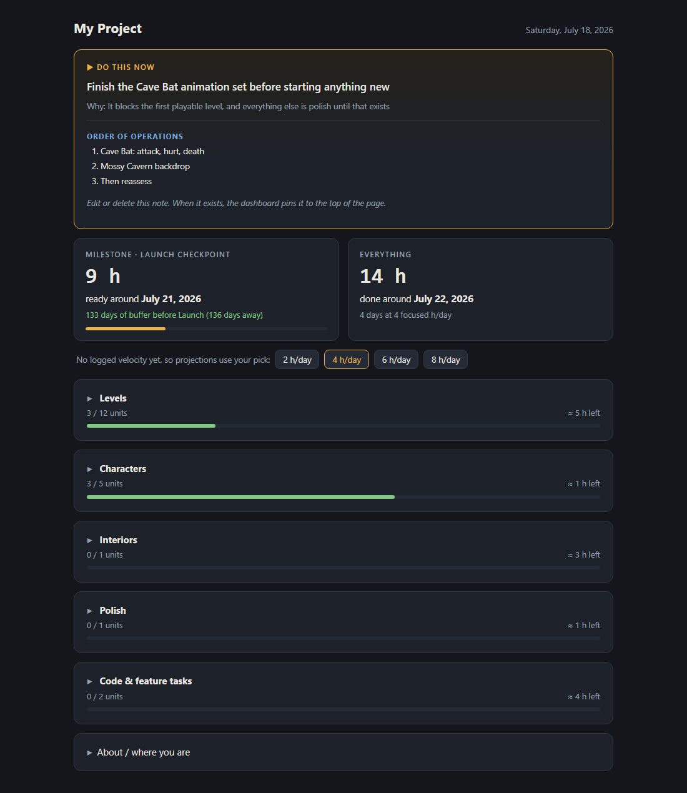

# markdown-task-dashboard

A local dashboard for solo projects with a real deadline. Your tasks are plain markdown files; this reads them and turns them into a countdown clock: estimated hours remaining, a projected finish date at your actual pace, and how that lands against the date you're aiming for.

Python standard library only. No installs, no database, no build step, no accounts. One Python file, one HTML file, and a folder of notes you already own.



## Quick start

```
python app.py
```

That serves the sample project at http://localhost:8787. Then open `app.py`, edit the config block at the top (project name, deadline, effort model, sections), and replace the notes in `tasks/` with your own.

## The idea

I built this to run production on my own game. The insight that made it stick: most project trackers count tasks, but what a deadline cares about is hours. So every unit of work carries a minutes estimate, and the dashboard adds up everything unchecked into one number, then divides by how many focused hours a day you actually work. The answer is a date. Either that date lands before your deadline or it doesn't, and you get to find out in July instead of October.

The other rule: the dashboard never owns your data. Notes are ordinary markdown with a few frontmatter fields. Checking a box on the page rewrites one line in one file. You can edit everything in any editor, including Obsidian, and nothing breaks.

## Note formats

**Content entities** live in `tasks/production/`, one note per thing your project needs (a character, a level, a chapter, an illustration set):

```yaml
---
id: monster-01
type: monster
name: "Cave Bat"
group: 1                # optional: entities sharing a group render together
units: [design, idle, attack, hurt, death]
done: [design, idle]
milestone: true         # counts toward the milestone tile
---
Notes about the entity go here and show on the page.
```

`units` is every piece of work the entity needs. `done` is what's finished. Each unit name maps to minutes through `UNIT_MINUTES` in the config block; unlisted names fall back to a default.

**Feature tasks** live in `tasks/` root, one note per task:

```yaml
---
id: save-system
title: "Save / load system"
status: in-progress     # todo | in-progress | blocked | done
estimate: M             # S | M | L, or explicit hours like 12h
area: code
milestone: true
---
```

**Two optional notes** change the page when they exist:

- `tasks/directive.md` pins a "do this now" card to the top. One `directive:` line, one `why:` line, and a markdown body. Useful when you keep opening the tracker and wondering what to work on.
- `tasks/production-log.md` is a table of what you finished and how long it really took. Once it has rows from the last 14 days, projections switch from your hand-picked pace to your measured one.

`summary.md` next to `app.py` renders in a box at the bottom for orientation notes.

## Config

Everything lives in one block at the top of `app.py`:

- `PROJECT_NAME`, `DEADLINE`, `DEADLINE_NAME`: the page title and the date the countdown measures against.
- `UNIT_MINUTES`: your effort model. Ground it in real pacing, not optimism, or the clock will comfort you instead of helping.
- `SECTION_OF_TYPE`, `SECTION_ORDER`, `SECTION_LABELS`: how entity types group into page sections. Rename these to fit your project; nothing else cares.

## Using this template

Click "Use this template" on GitHub (or fork it), delete the sample notes, write your own, set your deadline. That's the whole setup.

## License

MIT
